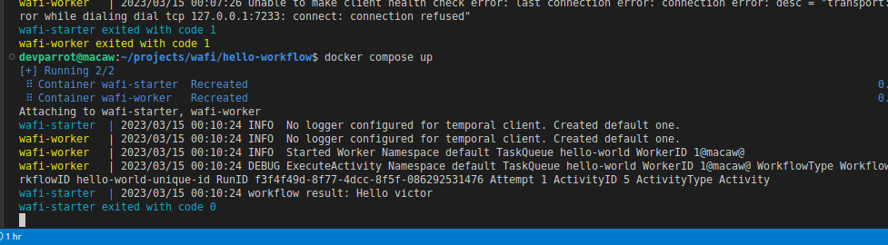

# Solution

## Setup
Setup was done using:
* [Compose](https://kompose.io/installation/): Kompose is a conversion tool for Docker Compose to container orchestrators such as Kubernetes
* [kubectl](https://kubernetes.io/docs/tasks/tools/#kubectl): The Kubernetes command-line tool, kubectl, allows you to run commands against Kubernetes clusters. You can use kubectl to deploy applications, inspect and manage cluster resources, and view logs
* [minikube](https://minikube.sigs.k8s.io/docs/start/): minikube is local Kubernetes. To make development seamless

### Start
#### Without Kubernetes

1. `$ cd docker`
2. `$ docker compose up` Start services

####

1. `$ minikube start` start local k8s
2. `$ cd docker`
3. `$ kompose convert -o k8s` Convert docker compose to k8s config (Optional)
4. `$ kubectl apply -f k8s` start deployment. Congratulations 💥💥💥💥
5. `$ minikube dashboard`
6. `$ minikub stop`

#### Improvement suggestion
* Add security and static test
* Add conditional alert when certain failures occurs. for example can't connect to db
* Reduce app build time.
* Prevent pushing changes directly to the master branch.